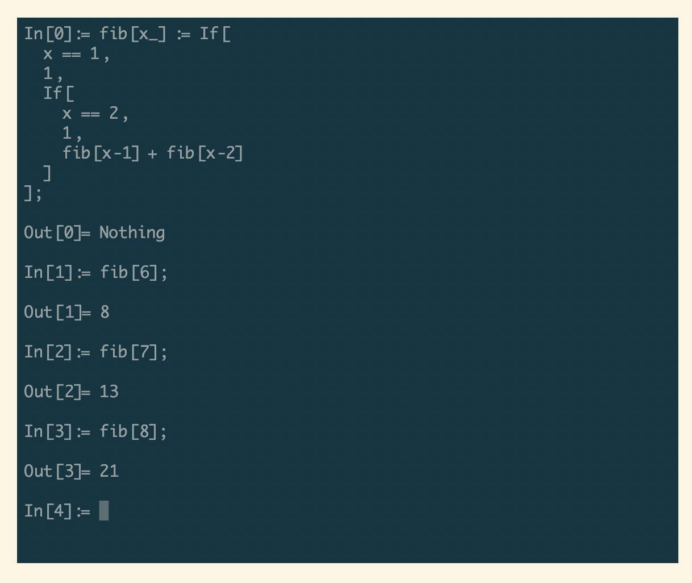
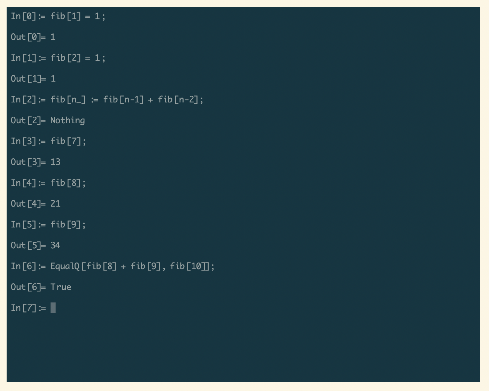
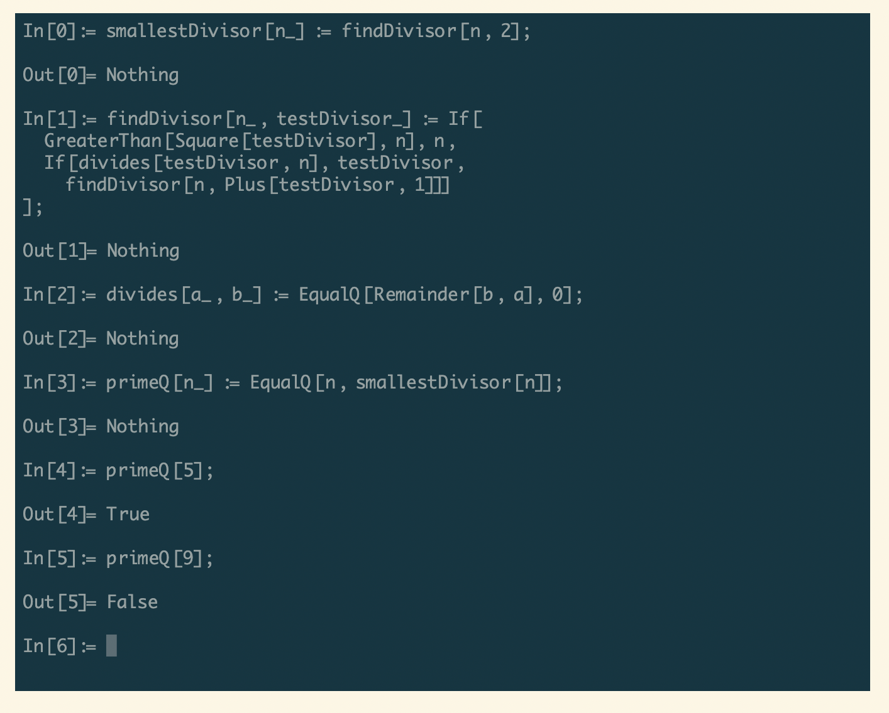
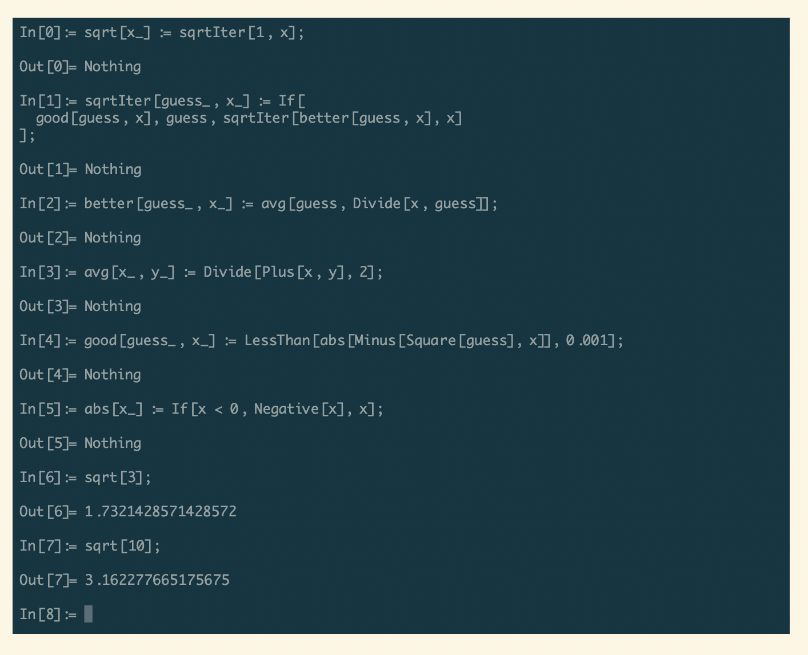

# 表达式求值器 Evaluator

这是一个命令行界面的表达式求值器，能进行一些简单的数学函数运算。支持自定义函数（包括递归函数），支持 If 分支执行。

This is a expression evaluator, it provides commandline interface, it is capable of doing some simple calculations (listed below), as well as of defining custom-defined functions.

这是基于 Nest 框架，以及作者自己写的 Lexer (词法分析器) 和 LL(1) Parser (语法分析器) 来实现的。

This project is based on [Nest.js Framework](https://nestjs.com/), and our own implementation of Lexer, LL(1) Parser, Translator and Evaluator.

## 项目展示

体验地址：https://fe-evaluator.vercel.app/



上图为斐波那契数列求值程序的树型递归写法。



上图为斐波那契数列求值程序的模式匹配写法。



上图为质性判定程序，能够判断一个整数是否是质数。



上图求出给定实数的正的平方根。

## 自部署

1. 测试表明此系统可在 node v16.13.0 LTS 及更高版本上正常运行，确保环境已经安装有合适版本的 node, npm 版本建议为 8.1.0 及以上；

2. `git clone`, 然后进入目录，然后 `npm install`, 成功安装项目所需依赖后，此步骤完成；

3. `npm run start:dev` 或者 `npm run start:inspect` 是启动开发测试环境，后者允许开发者通过 Chrome 或者 VS Code 的 "Attach to Node Process" 功能进行断点调试；`npm run build` 能够生成编译好的 JavaScript 文件（位于 dist 目录下），而后 `npm run start:prod` 可以正式启动系统；

4. 第 3 步完成后，本机的 3000 端口应该处于被某个 node 进程监听的状态，此时我们可以访问[项目的前端地址](https://fe-evaluator.vercel.app/), 并且切换到「本地会话」来使用本地部署的实例，在 Web 页面上的终端虚拟器中，执行 examples 目录下的例程可看到效果。

## 致敬 Respects

作者非常喜欢 Wolfram 语言，于是现在是处于上手实现一个简化再简化版本的这么样的一个状态。

I enjoy using Wolfram Language so much, by now I am coding my own very simplified version of it.

以下是我的启发来源：

Here are what I found interesting:

- [Evaluation of Expressions - Wolfram Language & System Documentation Center](https://reference.wolfram.com/language/tutorial/EvaluationOfExpressions.html)（表达式的求值）

- [Everything Is an Expression - Wolfram Language & System Documentation Center](https://reference.wolfram.com/language/tutorial/Expressions.html) (一切皆表达式)

- [Backtracking in Regular Expressions](https://docs.microsoft.com/en-us/dotnet/standard/base-types/backtracking-in-regular-expressions)（讲正则表达式匹配的，关键点就是「回溯」。）

## 已实现函数列表 Currently Supported Functions

当前的版本仍非常不稳定，很多功能没有做，也很容易触发 bug, 但是因为这是一个从 0 到 1 的突破，所以发了 1.0 版本。

```
Plus[x, y]                         # x+y
Minus[x, y]                        # x-y
Times[x, y]                        # x*y
Divide[x, y]                       # x/y
If[x, y, z]                        # 如果 x 为真，返回 y, 否则返回 z
EqualQ[x, y]                       # 若 x 等于 y, 则返回 true, 否则返回 false, 判断方式见源码
Exp[x]                             # 计算 e^{x}
Ln[x]                              # 计算 x 的自然对数
Remainder[x, y]                    # 计算 x 除以 y 得到的余数
Power[x, y]                        # 计算 x^y
Negative[x]                        # 计算 0 - x
Assign[lhs, rhs]                   # 固定赋值，在全局上下文中对 rhs 求值一次，之后如果对 lhs 求值，得到的都是这次 rhs 求值结果
AssignDelayed[lhs, rhs]            # 延迟赋值，在之后对 lhs 求值时，结果为那时在全局上下文中对 rhs 求值的结果
If[cond, trueClause, falseClause]  # 条件求值，先对 cond 求值，若结果不为假，则返回对 trueClause 的求值结果，否则返回对 falseClause 的求值结果
```
